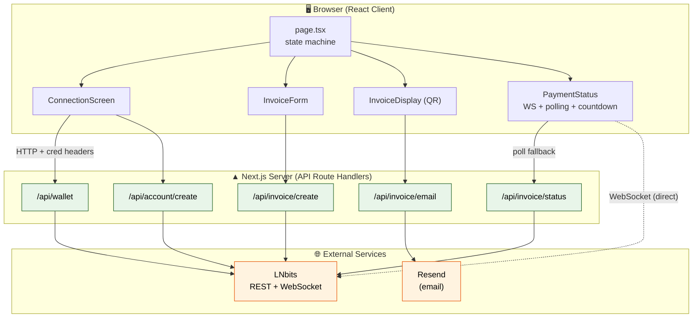
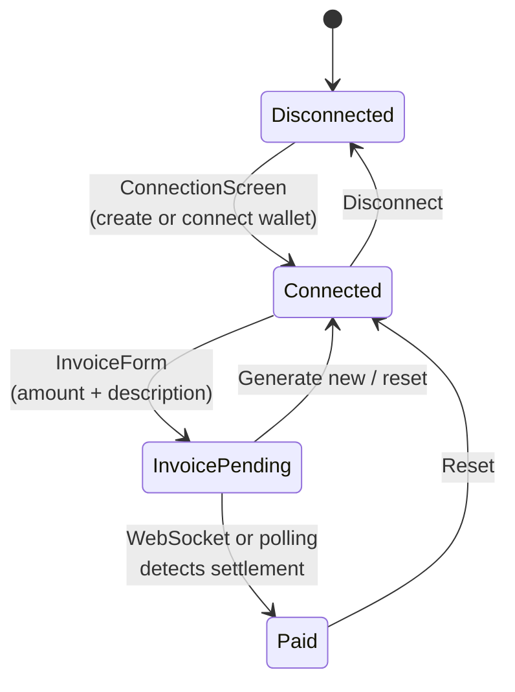
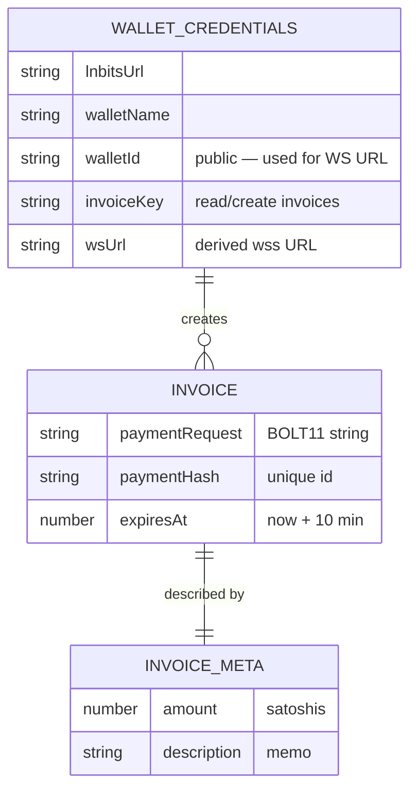
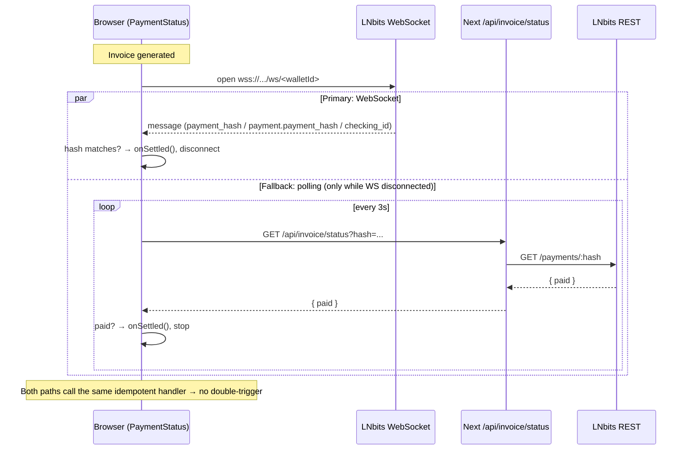
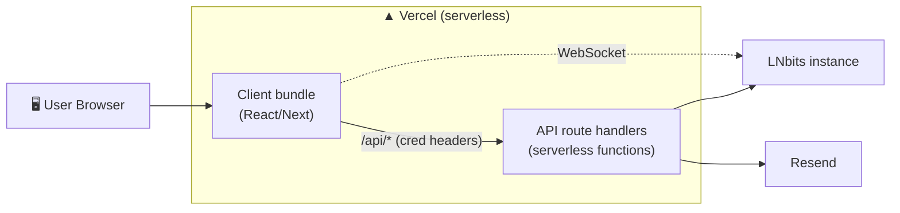

# LN-Breeze — System Architecture

> **Project 3 of 3 — Lightning Invoice Generator & Tracker**
> A browser-based app for generating Bitcoin **Lightning Network** invoices and detecting payments in real time — no CLI, no node operation, no technical setup for the end user.
> Live: **[ln-breeze.vercel.app](https://ln-breeze.vercel.app)**

---

## 1. Overview

LN-Breeze lets anyone connect a Lightning wallet, generate a BOLT11 invoice for a given amount of satoshis, share it as a QR code or string, and watch it flip to "paid" the instant the payment settles.

The system is a **Next.js 16 App Router** application that acts as a **secure server-side proxy** in front of [LNbits](https://lnbits.com) — an open-source Lightning wallet/accounts system exposed over a REST + WebSocket API. The browser never talks to LNbits directly and never handles admin credentials; all sensitive calls happen in Next.js **API route handlers** running on the server.

The defining architectural idea is **dual-channel real-time payment detection**: a WebSocket delivers instant settlement notifications, with a 3-second polling loop as an automatic fallback when the socket drops — both feeding a single idempotent "paid" handler so a payment is never missed or double-counted.

| Attribute | Value |
|---|---|
| Architecture style | Full-stack Next.js (App Router) with server-side API proxy (BFF) |
| Framework | Next.js 16 (App Router, TypeScript, React) |
| Lightning backend | LNbits REST API + WebSocket |
| Real-time | LNbits WebSocket (primary) + polling fallback (secondary) |
| Email | Resend |
| QR / UI | qrcode.react, Tailwind CSS + shadcn/ui (glassmorphism), Inter |
| Tests | Vitest + Testing Library (24 tests) |
| Hosting | Vercel |

---

## 2. High-Level Architecture

**Note the one direct browser→LNbits link:** the payment **WebSocket** connects straight from the browser to LNbits (`wss://<host>/api/v1/ws/<walletId>`). This is safe because the wallet ID is a public identifier that can only *receive* notifications — it cannot move funds. Everything that touches an API key goes through the Next.js server.

---

## 3. Technology Stack

| Layer | Technology | Role |
|---|---|---|
| **Framework** | Next.js 16 (App Router) | Unified client + server, route handlers, SSR |
| **Language** | TypeScript | End-to-end typing |
| **Lightning backend** | LNbits REST + WebSocket | Wallets, invoices, payment status, live events |
| **Real-time** | Native `WebSocket` + `usePolling` hook | Instant detection + resilient fallback |
| **Email** | Resend SDK | HTML invoice delivery |
| **QR** | qrcode.react + api.qrserver.com (in email) | Scannable BOLT11 |
| **UI** | Tailwind CSS, shadcn/ui, lucide-react, sonner | Glassmorphism UI + toasts |
| **Testing** | Vitest + @testing-library/react | 24 tests, no real funds/network |
| **Hosting** | Vercel | Serverless deployment |

---

## 4. Component Breakdown

### 4.1 Client (`app/page.tsx` + `components/`)

`page.tsx` is a **client-side state machine** driving the whole flow through four states: no credentials → no invoice → invoice pending → paid.

| Component | Responsibility |
|---|---|
| `ConnectionScreen` | Create a new LNbits wallet **or** connect existing (Invoice Key + Wallet ID) |
| `InvoiceForm` | Validate amount (sats) + description, request invoice creation |
| `InvoiceDisplay` | Render QR code, truncated BOLT11 with copy, email-invoice action |
| `PaymentStatus` | Live tracker: WebSocket + polling fallback, 10-min countdown, paid/expired screens |

Credentials for a connected wallet are held in React state and forwarded to the server as **custom `x-lnbits-*` headers** (`credentialHeaders()` in `page.tsx`) — never persisted to the browser bundle.

### 4.2 Server (`app/api/*/route.ts`)

Each route handler is a thin, credential-aware proxy to LNbits/Resend:

| Route | Method | Role |
|---|---|---|
| `/api/wallet` | GET | Validate credentials, return wallet name/balance **and derive the WebSocket URL** |
| `/api/account/create` | POST | Create a brand-new LNbits wallet (returns invoice + admin keys) |
| `/api/invoice/create` | POST | Validate amount/description, create a BOLT11 invoice (10-min expiry) |
| `/api/invoice/status` | GET | Check `paid` status for a payment hash (polling backend) |
| `/api/invoice/email` | POST | Render an HTML invoice (QR via external image URL) and send via Resend |

**Credential resolution pattern (used by every LNbits route):** read `x-lnbits-*` request headers first, fall back to server env vars (`LNBITS_URL`, `LNBITS_INVOICE_KEY`, `LNBITS_WALLET_ID`). This single expression lets the app run with a default server wallet **or** a user-supplied one, without leaking keys to the client.

### 4.3 Shared Libraries (`lib/`)

| Module | Role |
|---|---|
| `lnbits.ts` | Server-side LNbits helpers (`getWalletInfo`, `createInvoice`, `checkInvoiceStatus`) |
| `websocket.ts` | `InvoiceWebSocket` class — connect, match payment hash, exponential-backoff reconnect |
| `polling.ts` | `usePolling` React hook — 3s interval, stops on paid, survives network hiccups |
| `math.ts` | `parseSats()` — validates satoshi input |

---

## 5. Data Model

LN-Breeze is **stateless on the server** — there is no application database. State lives in two places: **LNbits** (the source of truth for wallets, invoices, and payment status) and **transient React state** in the browser.

- **`adminKey`** is returned when creating a wallet but the README/notes explicitly mark it "store but never expose in UI" — the browser only ever receives the invoice key, BOLT11, hash, and WS URL, none of which can drain funds.
- Nothing is persisted between sessions unless the user re-enters credentials.

---

## 6. Cross-Cutting Concerns

### Real-time detection (the signature design)

- WebSocket handles **three LNbits message shapes** and ignores malformed JSON.
- On close, it **reconnects with exponential backoff** (1s → 2s → 4s → … capped at 30s).
- Polling is enabled **only when the WebSocket is disconnected**, avoiding redundant load.

### Security
- ✅ **Keys are server-side only** — API keys live in env vars or travel as server-to-server headers; never bundled into client JS.
- ✅ The browser only receives **non-sensitive** data (BOLT11, hash, WS URL) — none can move funds.
- ✅ Admin key is captured on wallet creation but deliberately kept out of the UI.
- ✅ `.env.local` is gitignored.
- ⚠️ User-supplied credentials are held in browser memory (React state) for the session — fine for a self-service tool, but they are visible to that user's own client.

### Validation & resilience
- Invoice creation validates that amount is a **positive integer** number of sats and description is non-empty (both client and server side).
- Route handlers use `cache: "no-store"` so wallet/status reads are always fresh.
- 24 Vitest tests cover WebSocket message shapes, reconnect scheduling, polling lifecycle, and the status route — **no real funds or network required**.

### Email
- The email route renders a self-contained HTML invoice and sources the QR from a **public image URL** (`api.qrserver.com`) because Gmail blocks base64 data-URI images.

---

## 7. Deployment & Runtime Topology

- Deployed on **Vercel** with **Root Directory** set to `3lightning-invoice-generator-and-tracker`.
- Environment variables (`LNBITS_URL`, `LNBITS_INVOICE_KEY`, `LNBITS_WALLET_ID`, `LNBITS_ADMIN_KEY`, `RESEND_API_KEY`) are configured in Vercel settings and read **only** by server functions.
- API routes become **serverless functions**; the client is served as static/SSR assets. LNbits can be any instance (e.g. `demo.lnbits.com`).

---

## 8. Design Decisions & Trade-offs

| Decision | Rationale | Trade-off |
|---|---|---|
| Next.js API routes as a proxy (BFF) | Keep LNbits keys off the client; unify auth | Extra hop; serverless cold starts |
| WebSocket primary + polling fallback | Instant UX with guaranteed delivery if WS drops | More client complexity; must keep the "paid" handler idempotent |
| Direct browser→LNbits WebSocket | Real-time push without proxying sockets through Vercel | Exposes the (harmless) wallet ID; relies on LNbits WS uptime |
| Header-or-env credential resolution | One codebase supports a default wallet *and* BYO-wallet | Credentials live in browser memory during a session |
| Stateless server (no DB) | LNbits is the source of truth; simpler ops | No invoice history/analytics of our own |
| LNbits as the Lightning backend | No need to run/maintain a Lightning node | Dependent on the chosen LNbits instance's availability |
| External QR image in emails | Works around Gmail blocking data-URI images | Relies on a third-party QR service for email rendering |
